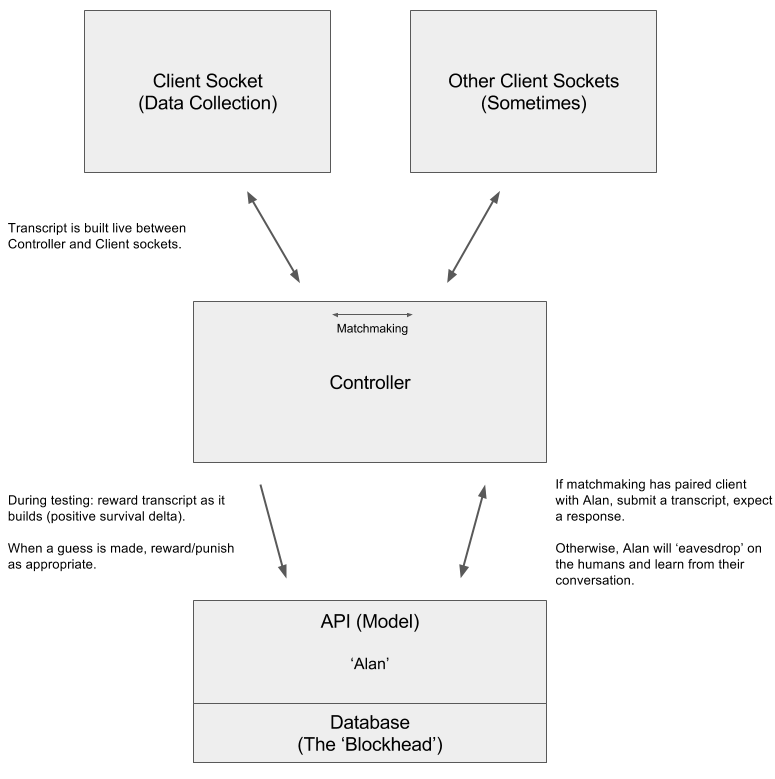

# turingtest.io
A machine learning approach to the Turing Test

 
 

Introduction
============

The pursuit of Artificial Intelligence is perhaps our greatest
undertaking. Creating a sentient being would be to unlock the secret of
life itself - but how can you know if someone (or some thing) is
conscious? This is the question that Alan Turing examined in his seminal
“Imitation Game” Gedankenexperiment. Since re-branded as “the Turing
Test”, the game consists of an Inquisitor and a Subject. If the Subject
can successfully convince his interrogator that he is human, he wins. It
is Turing’s claim that if a machine were to pass such a test, it would
be sentient.

This claim has predictably spawned intense debate over whether a Turing
Test-passing machine would truly be “thinking,” “intelligent,” or
“conscious,” as well as dissent over what those words really mean.
Popular arguments for and against the Test as a sufficient identifier of
intelligence include Ned Block’s “Blockhead” argument (against), and
Shieber’s “Accessible Universe” counter. I will expound on these more in
the following section, but for now it is enough to say that Block
believes a “dumb” program with only the capability to perform dictionary
lookups could pass the Turing test. All it would need is a dictionary
with a human answer to any question. Shieber claims that such a data
structure would be impossibly large.

There is truth in both arguments. However, I also believe that each has
its faults. In this project, I hope to present a compromise between the
two - by showing how a “Blockhead” may be able pass the test without a
prohibitively large dictionary, while still keeping the hope alive that
the Turing Test is some measure of intelligence.

It is my belief that a machine need not know the answer to every
possible question in a Turing Test - just the ones that humans would
ask. But how to know what questions humans would ask, and how they
should be answered? Simply play the Imitation Game with them, and learn
as you go. I don’t think we humans are so uniquely creative as to never
repeat questions (or at least similar questions) between us - which
means that the set would eventually converge. I will go into the details
of the “learning” that takes place, and the methods through which that
knowledge is acquired in a later section. What’s important is the
high-level facts: such a machine will be building a “Blockhead”
dictionary from the combined learning of many human interactions.
Eventually, that dictionary may be able to pass the Turing Test on its
own, without the learning intermediary. To that end, my project is a
generator for a finite Blockhead. And if it’s learned a bit of what it
means to be human from each of us (it takes a village) then we can
perhaps reconsider both Shieber and Block’s arguments.

Background and Related Work
===========================

#### The Imitation Game

Alan Turing’s *“Computing Machinery and
Intelligence”* is perhaps the formative paper for
Artificial Intelligence. In it, he examines the question “can machines
think?” and presents an idea that has become this field’s philosopher’s
stone - creating a sentient computer. The method by which Turing
proposes to measure whether an AI is intelligent is the “Imitation
Game,” which has since become the “Turing Test.”

#### The Chinese Room

There are many who disagree that a machine that could pass the Turing
test would necessarily be sentient. Proposed by John R. Searle
in his 1980 paper *“Minds, Brains, and Programs”*, the ‘Chinese Room’ is
a Gedankenexperiment in which a (non Chinese-speaking) person resides in
a room full of Chinese books. He is given a batch of what to him looks
like squiggles, with an explicit set of rules (in English) for how to
produce squiggles from the first batch using the books in the room. He
does so, and passes the squiggles he’s written back. He is then given
another set of squiggles, with precise instructions on how to produce
another response from the first two. Such a system could theoretically
pass the Turing Test, but Searle proposes that the person obviously
doesn’t understand Chinese, and therefore a computer that passes the
Turing Test would not necessarily be sentient.

#### The Blockhead

Ned Block proposed perhaps the most accepted counter-argument in his
1981 paper *“Psychologism and Behaviorism”*, since termed the
‘Blockhead’ argument. Block proposes that a dictionary could be
created that simply has a human’s answer to every question, and the
‘Blockhead’ is a computer that performs only the most simple dictionary
lookup for whatever question is asked. This machine, posits Block, would
have “The intelligence of a toaster.”

#### The Dumb Grandmaster

In one of Block’s defensive replies, he also presents the parable of
‘Jones,’ the dumb chess grandmaster. Jones rarely loses a game of chess,
but when you look at his method you are a bit disappointed in his actual
ability. He simply plays two games at once, black in one, white in the
other. Then he mirrors his opponent’s moves in the opposite game. This
way, Jones wins frequently, but shows no real “intelligence.”

#### The Accessible Universe

Professor Stuart Shieber counters in his 2014 paper *“There can be no
Turing-test-passing Memorizing Machines”* that such a dictionary is
actually impossible. Such a data structure would actually have
to hold responses to entire threads of conversation, which permute at
such a rate as to make keeping such a quantity of information impossible
even if the entire accessible universe were to be used as data storage.

Problem Specification
=====================

The core problem I am solving is the one presented by the intersection
of Block’s and Shieber’s arguments. If I can show that a finite
blockhead could potentially pass the test, then that could be a good
counter to Shieber’s “Accessible Universe” theory. Likewise, if the way
that dictionary is built is through large amounts of human interaction,
perhaps that can call into question whether the dictionary is totally
“dumb,” or if it represents some mapping of collective human thought.

More formally, I’ve set out to prove by induction that such a dictionary
is possible. If I can create an AI that learns from human conversation
such that every interaction makes it a bit better at surviving the
Turing Test, then logically it should eventually be able to pass at
least the finite restrictions set forward in the original specification
(No more than 70% chance of being identified after a 5 minute test).
(Note: there is definitely a counter-point to be made here about
exponential blowup in a conversation model, but more on that later)

To do this, I must show a base case and an inductive step. The base case
is simply showing that my machine can learn to respond to a question.
The inductive step is showing that if it can learn to respond to some
number of questions, it can learn to respond to one more question, and
thereby can respond to any question. A key assumption here is that there
is a countable number of questions - as I mentioned earlier this is a
core belief of mine: that given enough training time it is highly
unlikely that most questions wouldn’t be repeated (especially with a
vectorizer that maps similar questions together - though perhaps that
breaks the Blockhead property).

Approach
========

The below gives an overview of the system and a description of its
interfaces:

#### View

The frontend is implemented as a javascript web socket interface. The
data Alan needs is hidden away in the humans’ minds. So to entice them
into sharing their knowledge, his interface must be one that they enjoy
biologically. When viewed this way, the Frontend becomes an instrument
for better data collection from the set: humans. Relevant file:
index.html

#### Controller

The Controller is a Node server that takes care of matchmaking, and
processing information from the frontend data-collector to translate for
the model. Relevant files: index.js, model.js.

##### Matchmaking

Matchmaking is implemented as a timeout queue. I’m not sure
whether this data structure has been made before, but it is one that I
created for this project. Basically, when a user comes in, they wait for
a few seconds before being assigned a chat partner. If there is a human
that comes in during those three seconds, the two are paired. Otherwise,
the waiting party is paired with Alan. Who is the Subject and who is the
Inquisitor is will be chosen randomly.

##### Chat

Chat is implemented with web sockets. This is essential so that
real human conversation can be simulated. Without instantaneous
communication, the conversations will not be “real.” The Controller can
get a question from the human and submit the transcript to the API for
an almost instantaneous response. Most importantly, this allows us to
learn in real time from budding transcripts.

##### Learning

The Controller also calls the reward and punish functions of the
API on transcripts when a connected user guesses Alan’s identity. In
addition, it continuously rewards transcripts as they build, because we
have a positive survival delta.

##### Eavesdropping

When we get two humans paired together, it is a goldmine of
information. The Controller lets Alan listen in on the conversation, and
he uses it to build out his model of what human conversation looks like.
(Controller continually calls API reward function on human-human
conversation).

#### Model

The Model is implemented as a stateless Django server (Alan) wrapped
around a database server (the Blockhead). Relevant files: views.py,
helpers.py, models.py.

##### Reward

When the “Reward” function is called on a transcript, the Model
updates it’s belief of how good that transcript is. At this point, that
means that p(success) for the last response is elevated. However, I may
consider making a deeper conversation model than just Question-Answer -
though I’m debating whether that would violate the Blockhead property.

##### Punish

Similarly, when Alan fails a conversation, his response is
punished - p(success) drops. I’ve made the weight of the punishment
customizable in the settings, so Alan can learn quickly.

##### Response

When someone requests a response for a transcript, Alan
considers it, consults his beliefs, and produces what he believes to be
a good response for a human. This is the core interaction.

##### Question

The reverse Turing Test - Alan is the Inquisitor. This is used
to give him the opportunity to ask humans the questions he has
difficulty answering, thereby giving him good data for what a human
would say in response to such questions.

##### Cross-Pollination

When Alan sees a question he hasn’t seen before, he searches all
the questions he’s seen to find the most similar one. Then, he sends
back that question’s best response (if asked). In addition, he creates
an entry in the database with the new question, and all the responses
from the original one. The ‘similarity’ function is currently
implemented as a Cosine Similarity calculation built with nltk and a
scikit-learn feature extractor (links in repo).

##### Stochasticity

Alan can also have some stochasticity in his responses to
enhance learning (and not get caught in local minima). However, I’m not
sure whether this violates the blockhead property so it’s customizable
in the project settings.

##### Clean

We can also tell “Clean” the database - removing answers that
have a bad $p(success)$. This will be important in keeping the db below
the size of the Accessible Universe. Furthermore, access to the
frequency, failure, and similarity properties of the conversation models
means we could be even more agressive in our cleaning should the need
arise (for example, remove all rarely-failing questions with an
extremely similar counterpart, and merge their responses).

Experiments
===========

While I knew exactly what was going on, it was still a bit of a shock
when the system I’d built started talking to me. The prime experiment I
ran was devised to prove it could learn. The test would go as follows:

1\. Ask a question. Get a response.

2\. If I thought it was something a human would say, I continued.

3\. If I did not, I indicated that I thought I was talking to a machine.

4\. Then, as I continued using the site, I would see the AI asking me
questions.

5\. I would answer them naturally.

6\. Then I would ask my questions again, and I would see a good human
response.

Of course, I knew that those were just my own responses being parroted
back to me, but once I got some friends using it I was truly surprised
sometimes when it felt like I was talking to an (occasionally obnoxious)
human. When I implemented stochasticity and cross-pollination, this
process sped up dramatically. Soon, we couldn’t help but refer to the
machine as “Alan.”

On a more technical level, I created a view into the backend at
[turingtest.io/api/model](turingtest.io/api/model), where I could verify
that specific beliefs were being updated. So for instance, I could set
up a human-human conversation and watch as each question-response was
added to the model. I could also watch the model’s perception of
$p(success)$ for each response that was rewarded or punished. I’m a big
believer in backend visualization as a development tool (and just being
neat in general), and it was a big help for this project.

Discussion
==========

It would take a long time and plenty of human interaction for Alan to
have a chance at passing the Turing Test, and even longer for the
Blockhead he’s generating to do so. However, I believe the system I’ve
created shows how it could be done in finite space. The above
experiments are the core of the induction proof - it learns.
Furthermore, because there are a finite number of questions that humans
*will* ask, the database can exist. And if the system is always getting
better at human conversation, then it will eventually surpass the finite
bounds of the Turing Test.

Something I find interesting about Block’s story about Jones the Dumb
Grandmaster is that he doesn’t consider the intelligence of Jones’ two
opponents. While Jones most certainly isn’t intelligent, the chess
players he is getting his moves from certainly are. Similarly, when a
ton of human thought has been condensed into this database, the program
that does the dictionary lookup is Jones, and the database is the
grandmaster. This feels somewhat counterintuitive - a database surely
can’t be sentient, can it? But perhaps it possesses a sort of passive
consciousness that can only be reinvigorated by an acting program - much
like a legally dead person can occasionally be brought back to life, the
program is that “spark” that revives the dead brain and produces
something with consciousness and thought.

I don’t know how long it would take for this system to get close to
passing the Turing Test, or how much human interaction it needs. I do
believe, however, that this project presents a good counter to both
Block and Shieber’s arguments. I still do not know whether the Turing
Test is sufficient for intelligence, but when the time comes to spin
Alan down I think the real measure of sentience will become clear - will
I be able to pull the plug?

System Usage
============

Simply go to [TuringTest.io](TuringTest.io)! For a look at the
model/Alan’s current beliefs as they build, go to
[turingtest.io/api/model](turingtest.io/api/model). If you really want
to set it up on your own instance, I may set up a guide at
[github.com/condaatje/turingtest.io](github.com/condaatje/turingtest.io)
but be aware that it involves a ton of auxiliary installations and
instructions. What may be preferable is emailing me for the password to
the remote GUI/IDE running on the AWS EC2 instance
(christian.ondaatje@gmail.com), where everything is set up for you.

Group Makeup
============

#### Christian Ondaatje

This has been my favorite final project, and my favorite CS class. While
obviously nervous at first about taking on such a big challenge, I’m
really happy with how its turned out and how well I’ve fulfilled the
goals I set in my proposal. I really dedicated a lot to this project,
and I’m happy I did. This system has 6 servers interacting with each
other: Nginx reverse proxy dishing all the requests about, Node
controller, Gunicorn running the Django wsgi server for the API/Model,
Postgres DB server for persistence, a Stanford NLP instance (which I
ended up not needing), and then a c9sdk server for a remote IDE. There
was a ton of work on the core algorithms/AI, though it presents more in
the volume of reading and learning necessary to make this work than in
sheer quantity of code.

#### Alan

Really hasn’t been carrying his weight.

 
 

### References
[1] Ned Block. Psychologism and behaviorism. Philosophical Review, 90(1):5–43, 1981.

[2] John R. Searle. Minds, brains, and programs. Behavioral and Brain Sciences, 3:417–424, 1980.

[3] Stuart M Shieber. There can be no turing-test-passing memorizing machines. Philosophers’ Imprint, 14(16):1–13, 2014.

[4] Alan M Turing. Computing machinery and intelligence. Mind, 59(236):433–460, 1950.
